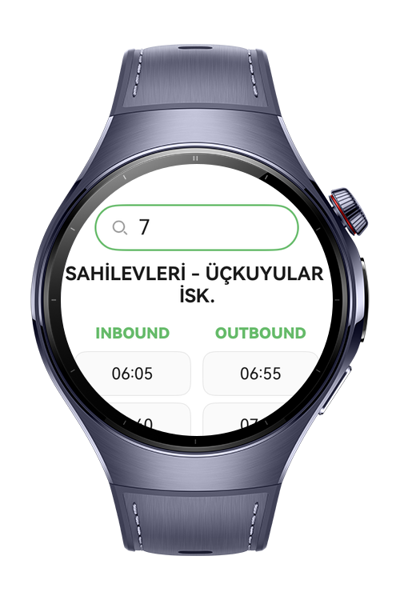
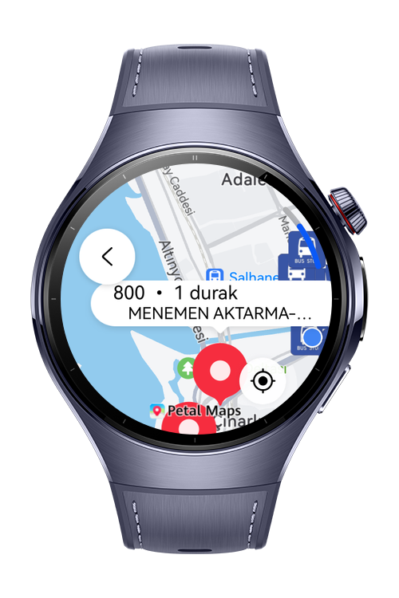
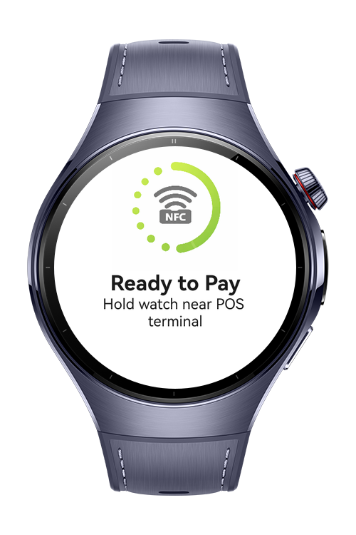
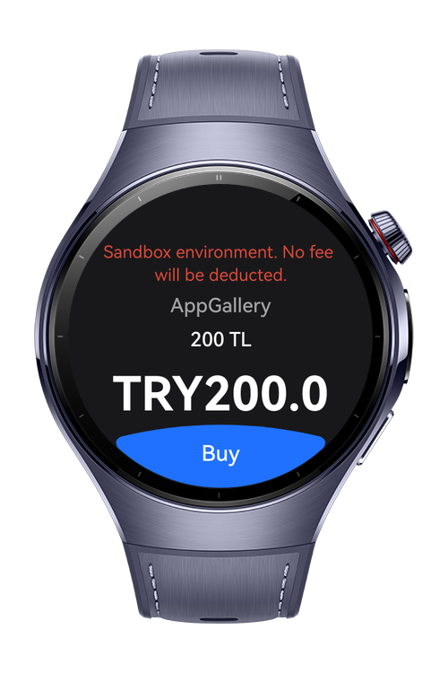

# Transportation Smart Wearable

**Transportation Smart Wearable** is a smart wearable transit application that displays bus and stop information
provided by İzmir Metropolitan Municipality. It offers an end-to-end experience that combines secure sign-in with Huawei
ID, in-app balance top-up (In-App Purchase), and QR/NFC payments in a single flow. Users can also search by bus number
and use the map to view nearby stops, see which buses will arrive, and track how many stops away each bus is.

1) Login

When the app is launched, the user signs in via Huawei Authentication using their Huawei ID. This ensures secure account
access and enables personalized features such as balance and payment actions.

2) Balance Top-Up (In-App Purchase)

Users can add funds to their account through In-App Purchase. The updated balance is then available for both QR and NFC
payment flows.

3) Payment Options (QR / NFC)

QR Payment: The app generates a payment QR code using CryptoKit (QR code generation), allowing the user to complete the
transaction by presenting the QR code.

NFC Payment: Users can pay via NFC using HCE (Host Card Emulation) for contactless payments.

4) Search (Bus Number)

The Search module lets users quickly find information by entering a bus number, enabling fast access to the relevant
bus/line details.

5) Map & Stop Information

On the Map screen, users can view nearby bus stops. For a selected stop, the app:

Lists incoming buses, and

Shows how many stops away each bus is.

# Preview

<p align="left">
    
    
    
    
</p>

# Use Cases

1. Sign in with Huawei ID

User opens the app → signs in with Huawei ID → authentication is completed.

2. Top up balance via In-App Purchase

User opens the Top-Up screen → selects an amount/package → completes IAP → balance is updated.

3. Pay with QR code

User selects QR Payment → app generates a QR code via CryptoKit → user presents the QR code to complete payment.

4. Pay with NFC 

User selects NFC Payment → taps the device on a reader → payment 

5. Search by bus number

User opens Search → enters a bus number → views matching bus/line information.

6. View nearby stops on the map

User opens Map → nearby stops are displayed → user selects a stop.

7. Track incoming buses for a stop

User selects a stop → views incoming buses → tracks “stops remaining” for each bus.

# Technology

## Stack

**Languages**: ArkTS, ArkUI  
**Frameworks**: HarmonyOS SDK 6.0.1(21) 
**Tools**: DevEco Studio 6.0.1  
**Libraries/Kits**:

- @kit.IAPKit
- @kit.AbilityKit
- @kit.AccountKit
- @kit.BasicServicesKit
- @kit.PerformanceAnalysisKit
- @kit.MapKit
- @kit.Connectivity
- @kit.CryptoArchitectureKit
- @ohos.net.http

# Directory Structure

```
│   module.json5
│
├───ets
│   ├───common
│   │       Common.ets
│   │       IapProductConstants.ets
│   │
│   ├───component
│   │   │   QrCard.ets
│   │   │
│   │   ├───login
│   │   │       LoginHeader.ets
│   │   │
│   │   └───nfcPay
│   │           PaymentActionButton.ets
│   │           PaymentComponents.ets
│   │           PaymentResultComponents.ets
│   │
│   ├───data
│   │       CoreResourceProvider.ets
│   │       RawDataManager.ets
│   │
│   ├───entryability
│   │       EntryAbility.ets
│   │
│   ├───entrybackupability
│   │       EntryBackupAbility.ets
│   │
│   ├───model
│   │   │   AnnouncementModel.ets
│   │   │   ApproachingBusModel.ets
│   │   │   CardItemModel.ets
│   │   │   CardModel.ets
│   │   │   MainMenuItemModel.ets
│   │   │   NearbyStopModel.ets
│   │   │   PaymentRoute.ets
│   │   │   UserModel.ets
│   │   │
│   │   └───searchPageModel
│   │           BusLine.ets
│   │           BusSchedule.ets
│   │           BusStop.ets
│   │           CKANResponse.ets
│   │           CKANResult.ets
│   │           RawBusLine.ets
│   │           RawBusSchedule.ets
│   │           RawBusStop.ets
│   │
│   ├───pages
│   │   │   Index.ets
│   │   │
│   │   ├───announcements
│   │   │       AnnouncementsView.ets
│   │   │       AnnouncementsViewModel.ets
│   │   │
│   │   ├───balance
│   │   │   ├───state
│   │   │   │       BalanceDetailPageState.ets
│   │   │   │       IBalanceDetailPageState.ets
│   │   │   │
│   │   │   ├───view
│   │   │   │       BalanceDetailPage.ets
│   │   │   │       BalancePage.ets
│   │   │   │
│   │   │   └───viewModel
│   │   │           BalanceDetailPageViewModel.ets
│   │   │           CardData.ets
│   │   │
│   │   ├───home
│   │   │       HomePage.ets
│   │   │
│   │   ├───login
│   │   │       LoginView.ets
│   │   │       LoginViewModel.ets
│   │   │
│   │   ├───map
│   │   │   ├───view
│   │   │   │       MapPage.ets
│   │   │   │
│   │   │   └───viewmodel
│   │   │           MapViewModel.ets
│   │   │
│   │   ├───qr
│   │   │   │   AppNav.ets
│   │   │   │
│   │   │   ├───view
│   │   │   │       NfcPayPage.ets
│   │   │   │       PaymentHomePage.ets
│   │   │   │       PaymentStatePage.ets
│   │   │   │       QrPayPage.ets
│   │   │   │
│   │   │   └───viewmodel
│   │   │           PaymentHomeViewModel.ets
│   │   │           PaymentIndexViewModel.ets
│   │   │           PaymentResultViewModel.ets
│   │   │           QrPayViewModel.ets
│   │   │
│   │   ├───search
│   │   │       SearchPage.ets
│   │   │       SearchPageViewModel.ets
│   │   │
│   │   └───splash
│   │           SplashPage.ets
│   │
│   └───service
│       │   IdGeneratorService.ets
│       │   TransportationService.ets
│       │
│       └───searchPageService
│               ApiManager.ets
│               EshotService.ets
│
└───resources
    ├───base
    │   ├───element
    │   │       color.json
    │   │       float.json
    │   │       string.json
    │   │
    │   ├───media
    │   │       background.png
    │   │       disabledNfc.png
    │   │       foreground.png
    │   │       layered_image.json
    │   │       loadingNfc.png
    │   │       noNfc.png
    │   │       paymentFailed.png
    │   │       paymentSuccess.png
    │   │       startIcon.png
    │   │
    │   └───profile
    │           backup_config.json
    │           main_pages.json
    │
    ├───dark
    │   └───element
    │           color.json
    │
    └───rawfile
            BusInformation.json
            BusMoveTime.json
            bus_stop.png
            payment_failed.mp3
            payment_success.mp3
```

# Constraints and Restrictions

## Supported Device

- Huawei Watch 5

# License

**Transportation Smart Wearable** is distributed under the terms of the **MIT License**
See the [LICENSE](LICENSE) for more information.